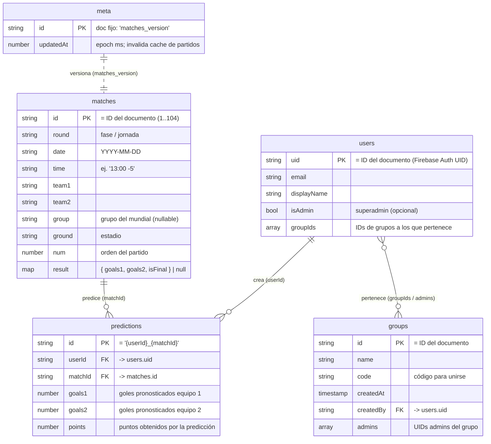

# Modelo de datos — Polla Amigos

La base de datos es **Cloud Firestore** (NoSQL, orientado a documentos). No hay
tablas ni relaciones forzadas por el motor: las "relaciones" se modelan guardando
IDs dentro de los documentos. A continuación se documenta cada **colección**, sus
campos y cómo se relacionan.

## Diagrama de relaciones

> Nota: en Firestore las flechas no son claves foráneas reales; son referencias
> por ID que la aplicación resuelve manualmente.

## Colecciones

### `users`
Perfil de cada usuario. El **ID del documento es el UID de Firebase Auth**.

| Campo | Tipo | Descripción |
|-------|------|-------------|
| `uid` | string | UID (igual al ID del documento). |
| `email` | string | Correo del usuario. |
| `displayName` | string | Nombre visible. |
| `isAdmin` | boolean? | `true` = superadministrador global. |
| `groupIds` | string[]? | IDs de los grupos a los que pertenece. |

> **Sin puntaje denormalizado.** El escalafón ya **no** guarda un `points` en
> `users`. La app calcula el puntaje de cada usuario en el cliente a partir de
> sus `predictions` y los `result` de los `matches` (ver `computeCumulativePoints`
> en `src/lib/scoreCalculator.ts`): el total de un usuario es el acumulado
> (`afterMatchPoints`) de su **último partido cerrado**. Al no depender de un
> contador que se actualiza por separado, el escalafón no puede quedar
> "atrasado" respecto a los resultados. Un usuario sin pronóstico para un
> partido simplemente no suma en ese partido (no se crea ningún registro
> vacío).

### `matches`
Partidos del Mundial 2026 (sembrados desde `src/app/worldcup2026.json`, IDs `"1"`–`"104"`).

| Campo | Tipo | Descripción |
|-------|------|-------------|
| `id` | string | ID del documento (`"1"`..`"104"`). |
| `round` | string | Fase o jornada. |
| `date` | string | Fecha `YYYY-MM-DD`. |
| `time` | string | Hora con offset, ej. `"13:00 -5"`. |
| `team1` / `team2` | string | Equipos. |
| `group` | string \| null | Grupo del mundial (null en eliminatorias). |
| `ground` | string | Estadio / sede. |
| `num` | number | Orden del partido (usado para ordenar y para el x2). |
| `result` | map \| null | `{ goals1, goals2, isFinal? }`; null si no se ha jugado. |

### `predictions`
Pronóstico de un usuario para un partido. El **ID es `{userId}_{matchId}`**, lo que
garantiza una sola predicción por usuario y partido.

| Campo | Tipo | Descripción |
|-------|------|-------------|
| `id` | string | `{userId}_{matchId}`. |
| `userId` | string | Referencia a `users.uid`. |
| `matchId` | string | Referencia a `matches.id`. |
| `goals1` / `goals2` | number | Goles pronosticados. |
| `points` | number | Puntos obtenidos (ver reglas de puntaje). |

**Reglas de puntaje** (`src/lib/scoreCalculator.ts`):
- **5 pts** — marcador exacto.
- **3 pts** — acierta el resultado (gana/empata) pero no el marcador.
- **1 pt** — acierta los goles de uno de los equipos.
- **0 pts** — ninguna de las anteriores.
- **x2** — los partidos de fase eliminatoria (`num >= 73`) duplican los puntos.

### `groups`
Grupos de amigos para rankings privados.

| Campo | Tipo | Descripción |
|-------|------|-------------|
| `id` | string | ID del documento. |
| `name` | string | Nombre del grupo. |
| `code` | string | Código para unirse. |
| `createdAt` | timestamp | Fecha de creación. |
| `createdBy` | string | UID del creador. |
| `admins` | string[]? | UIDs de administradores del grupo. |

### `meta`
Metadatos de control. Documento fijo **`matches_version`** usado como mecanismo de
invalidación de caché: la app compara `updatedAt` para decidir si recarga los
partidos y ahorrar lecturas de Firestore.

| Campo | Tipo | Descripción |
|-------|------|-------------|
| `updatedAt` | number | Epoch en ms de la última actualización de partidos. |

## Seguridad (resumen de `firestore.rules`)
- `users`: lectura para autenticados; escritura solo del propio usuario, de un admin, o cambios únicamente a `groupIds`.
- `matches`: lectura para autenticados; escritura solo admins.
- `predictions`: lectura para autenticados; escritura del dueño (`userId`) o admin.
- `groups`: lectura pública; crear con sesión; actualizar superadmin o admin del grupo; borrar solo superadmin.
